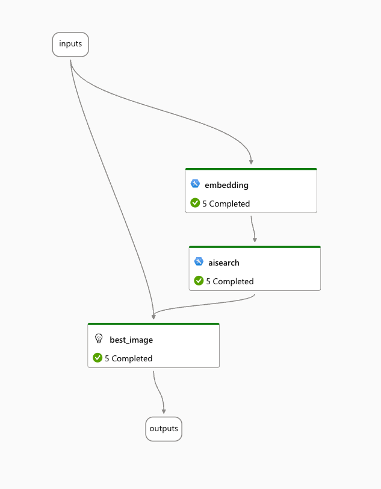

# Prompt Flow sample

The Python app in this folder depends on an Azure ML online endpoint that hosts a flow created in Prompt flow:



Your `.env` file requires a `PROMPT_FLOW_KEY`

```bash
PROMPT_FLOW_KEY=YOURKEY
```

Check my blog for more information about creating the flow (post not created yet). For now, just know that the flow works like this:

- takes a string as input (description)
- creates an embedding from the string
- performs a similarity search to find similar image descriptions and returns name, description and url from the index (requires an index with this data; check my blog)
- the output of the search (3 results) is handed to an LLM where the prompt asks to return the best matching url; if there is no match it returns NO_IMAGE
- the output of the flow is the LLM output

When a flow like the above is deployed to an online endpoint, the code in `app.py` can be used to call the endpoint with just the JSON below:

```json
{
    "description": "YOUR DESCRIPTION e.g. financial district"
}
```

Note: the code takes a parameter. For example:

```bash
python3 app.py cat
```

When run with a parameter, the url is printed but the image is not retrieved.

When you do not supply a parameter, you are asked for the description. The image (if url is valid) is download and displayed.
